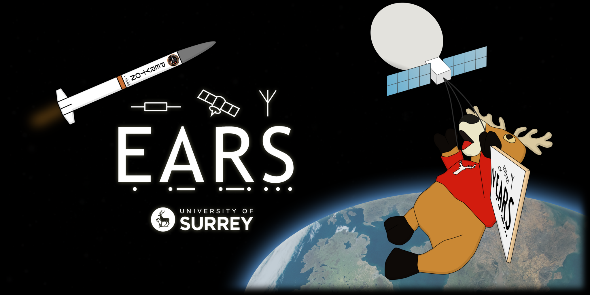

# Hello World! :wave:

<picture>
  <source media="(prefers-color-scheme: dark)" srcset="BannerWebsite3-2048x1024.png">
  
</picture>

Welcome to the GitHub organisation for the University of Surrey's Electronics and Amateur Radio Society.

The Electronics and Amateur Radio Society aims to support students in exploring all aspects of electronics, amateur radio, and even space technologies. We do this via our Makerspace, Radio Shack, and all manner of taught courses and social events.

We welcome all students, regardless of their university course! If you have any interest at all in electronics, we’d be delighted to have you.

More information can be found below:

- [Website](https://surreyears.co.uk)
- [Project & History Site](https://surreyears.github.io)
- [LinkedIn](https://www.linkedin.com/company/surreyears/)
- [Linktree](https://linktr.ee/SurreyEARS)